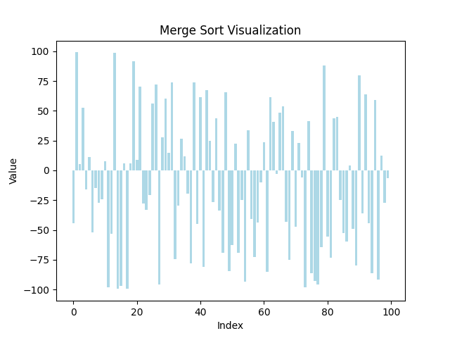
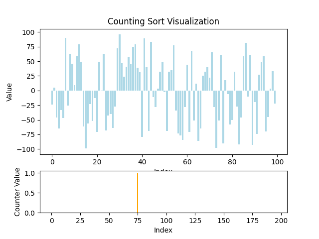

# What is in here

* Some performance notes on sorts: [for floats](sorts_for_floats.md) and
[for integers](sorts_for_integers.md)

If you want source notebooks - they are provided here too
(sorts_for_floats.ipynb and sorts_for_integers.ipynb) for convenience.

* Tuning notebooks and markdowns for [merge_sort](merge_sort_tuning.md)

* Animations:

  * Of merge_sort

    

  * Of count sort

    

All made the following way:

Visualizations.ipynb -> ...visualization.html + frames -> conversion to gif
using magick

If they do not work for some reason - you can check them out yourself in this
folder!
