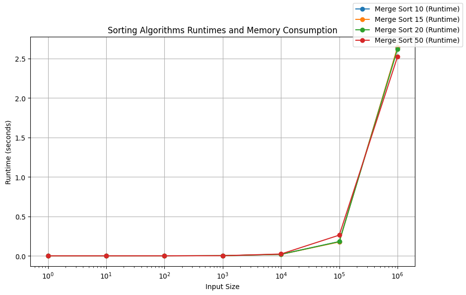
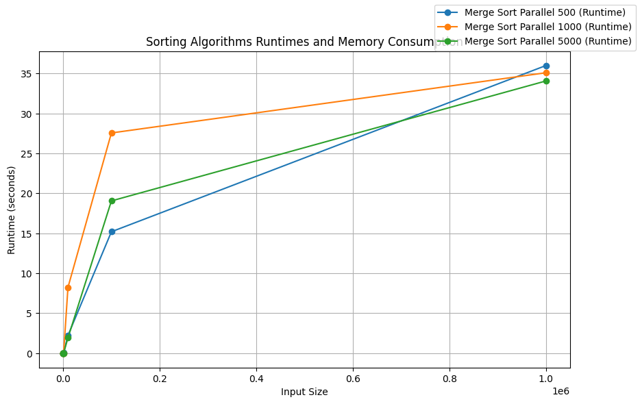

```python
import timeit
import psutil
import sys
import os
import matplotlib.pyplot as plt

from multiprocessing import cpu_count
from concurrent.futures import ProcessPoolExecutor as Pool
```


```python
def measure_runtime(func, params, array):
    start_time = timeit.default_timer()
    func(array, **params)
    end_time = timeit.default_timer()
    runtime = end_time - start_time
    return runtime
```


```python
def run_tests_float(sort_functions, funcs_params, input_sizes, input_range,
                    executor=Pool):
    data = {label: [] for _, label in sort_functions}
    with executor(max_workers=cpu_count()) as pool:
        for sort_func, label in sort_functions:
            for size in input_sizes:
                array = random_1_dim_array(
                    elts_range=input_range, size_of_1_dim_range=size)
                data[label].append(pool.submit(
                    measure_runtime, sort_func,
                    funcs_params[label],
                    array))
        for sort_func, label in sort_functions:
            for i in range(len(data[label])):
                data[label][i] = data[label][i].result()
    return data
```


```python
def plot_results(data_to_plot):
    fig, ax1 = plt.subplots(figsize=(10, 6))

    for label in data_to_plot:
        ax1.plot([i[0] for i in input_sizes], [sum(runtime)/len(runtime) \
                        for runtime in data_to_plot[label]], marker='o', label=f'{label} (Runtime)')

    ax1.set_xlabel('Input Size')
    ax1.set_ylabel('Runtime (seconds)')
    fig.legend(loc='upper right')
    plt.grid(True)
    plt.title('Sorting Algorithms\' Runtimes')
    plt.show()

def plot_results_log(data_to_plot):
    fig, ax1 = plt.subplots(figsize=(10, 6))

    for label in data_to_plot:
        ax1.plot([i[0] for i in input_sizes], [sum(runtime)/len(runtime) \
                        for runtime in data_to_plot[label]], marker='o', label=f'{label} (Runtime)')

    ax1.set_xlabel('Input Size')
    ax1.set_ylabel('Runtime (seconds)')
    ax1.set_xscale('log')
    fig.legend(loc='upper right')
    plt.grid(True)
    plt.title('Sorting Algorithms\' Runtimes')
    plt.show()
```


```python
os.chdir('../../../')
sys.path.append(os.getcwd())
from Algorithms.python_solutions.merge_sort import merge_sort, merge_sort_parallel
from Algorithms.python_solutions.tests.test_sorts_and_searches import random_1_dim_array
```


```python
input_sizes = [(1, 1), (10, 10), (100, 100), (1000, 1000), (10000, 10000), 
               (100000, 100000), (1000000, 1000000)]

sorting_algorithms = [
    (merge_sort, 'Merge Sort 10'),
    (merge_sort, 'Merge Sort 15'),
    (merge_sort, 'Merge Sort 20'),
    (merge_sort, 'Merge Sort 50'),
]

funcs_params = {
    'Merge Sort 10': {'batch_size': 10},
    'Merge Sort 15': {'batch_size': 15},
    'Merge Sort 20': {'batch_size': 20},
    'Merge Sort 50': {'batch_size': 50}
}

input_range = (-100, 100)
```


```python
full_data = []
for _ in range(10):
    one_test_data = run_tests_float(sorting_algorithms, funcs_params, input_sizes, input_range)
    full_data.append(one_test_data)
```


```python
data_to_plot = {label: [[full_data[i][label][j] for i in range(10)] for j in range(len(input_sizes))] for _, label in sorting_algorithms}
plot_results_log(data_to_plot)
```


    

    


```python
input_sizes = [(1, 1), (10, 10), (100, 100), (1000, 1000), 
               (10000, 10000), (100000, 100000), (1000000, 1000000)]

sorting_algorithms = [
    (merge_sort_parallel, 'Merge Sort Parallel 500'),
    (merge_sort_parallel, 'Merge Sort Parallel 1000'),
    (merge_sort_parallel, 'Merge Sort Parallel 5000')
]

funcs_params = {
    'Merge Sort Parallel 500': {'batch_size': 500},
    'Merge Sort Parallel 1000': {'batch_size': 1000},
    'Merge Sort Parallel 5000': {'batch_size': 5000}
}
```


```python
full_data = []
for _ in range(10):
    one_test_data = run_tests_float(sorting_algorithms, funcs_params, input_sizes, input_range)
    full_data.append(one_test_data)
```


```python
data_to_plot = {label: [[full_data[i][label][j] for i in range(10)] for j in range(len(input_sizes))] for _, label in sorting_algorithms}
plot_results(data_to_plot)
```


    

    


```python
sorting_algorithms = [
    (merge_sort, 'Merge Sort'),
    (merge_sort_parallel, 'Merge Sort Parallel')
]

funcs_params = {
    'Merge Sort': {},
    'Merge Sort Parallel': {}
}
```


```python
full_data = []
for _ in range(10):
    one_test_data = run_tests_float(sorting_algorithms, funcs_params, input_sizes, input_range)
    full_data.append(one_test_data)
```


```python
data_to_plot = {label: [[full_data[i][label][j] for i in range(10)] for j in range(len(input_sizes))] for _, label in sorting_algorithms}
plot_results_log(data_to_plot)
```


    

    


While for merge sort there is almost no effect for batch size changing because insertion sort does not give overwhelming benefit compared to merge sort, we can see that parallelization brings a decrease in performance, which is most likely due to the recursion overhead and the python handles multiprocessing itself.
